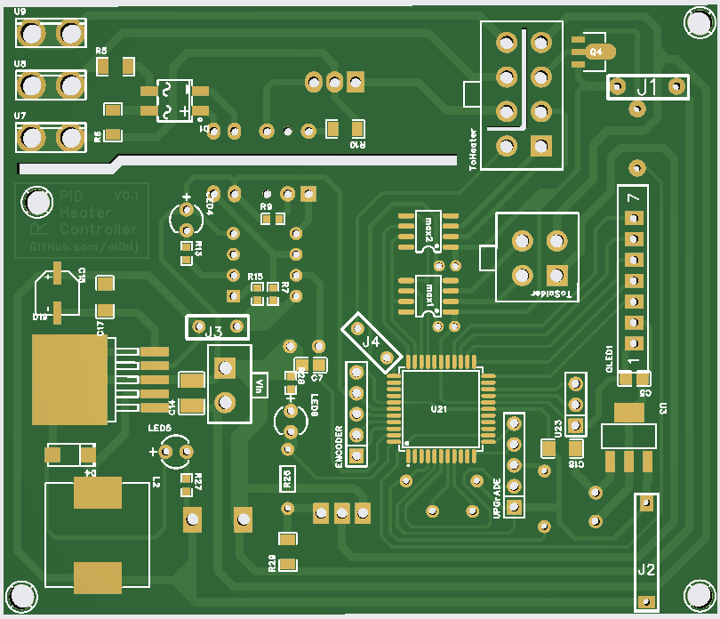
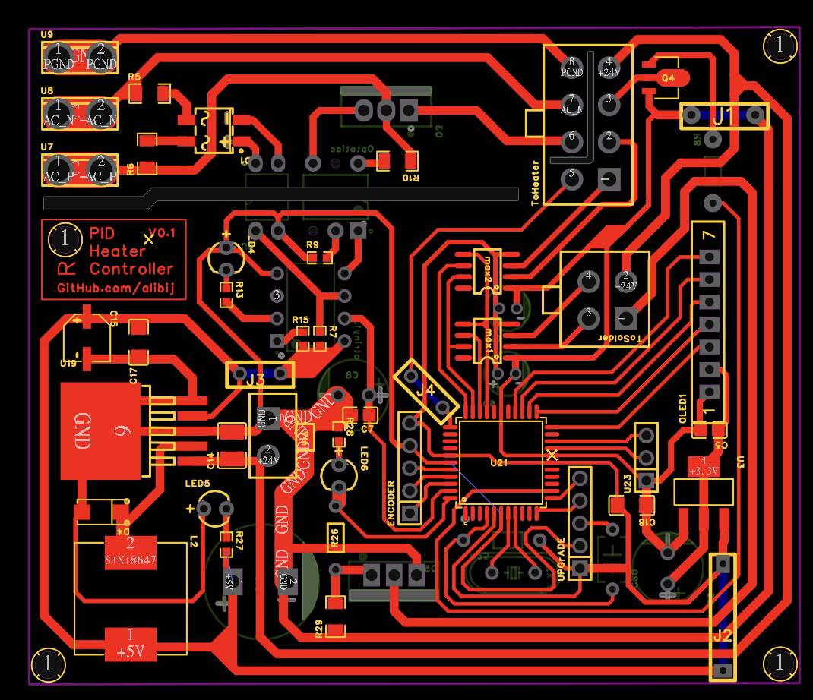

# 🔥 Arduino Soldering & Heater Controller

A complete dual-channel temperature controller for a soldering iron and a hot air heater, based on Arduino.  
It supports temperature regulation, fan control, Boost Mode, a user-friendly menu system with a rotary encoder, and an OLED display. All configurations are stored in EEPROM.

✅ **Schematic, PCB layout, and BOM are included in the root directory.**  
✅ **Main code file: `SolderingIronController.ino`**

---

## 📷 Preview

---

## 📦 Features

- Two-channel temperature monitoring via MAX6675 (for soldering iron and heater)
- PID control for stable temperature regulation
- Fan speed control with automatic cooling mode
- Boost Mode for fast preheating
- OLED display (128×64, SPI) for live status and menu interface
- Rotary encoder for easy menu navigation
- EEPROM storage for persistent settings
- Menu options for:
  - PID tuning (Kp, Ki, Kd)
  - Temperature configuration
  - Boost Mode toggle

---

## 🧰 Hardware Requirements

| Component           | Description                               |
|--------------------|-------------------------------------------|
| **MCU**            | Arduino (Uno, Nano, Pro Mini, etc.)        |
| **Display**        | OLED SSD1306 (SPI)                         |
| **Sensors**        | 2× MAX6675 thermocouples                   |
| **Encoder**        | Rotary encoder with push-button            |
| **Outputs**        | PWM pins for solder (Pin 10), heater (Pin 7), fan (Pin 30) |
| **Toggle Buttons** | Solder enable (Pin 23), Heater enable (Pin 22) |
| **Others**         | Power drivers (e.g., MOSFETs), connectors, etc. |

---

## 🚀 How to Use

1. **Install Required Libraries** from Arduino Library Manager:
   - `Adafruit_GFX`
   - `Adafruit_SSD1306`
   - `Encoder`
   - `PID_v1`
   - `MAX6675`
   - `EEPROM`

2. **Upload the Sketch**
   - Open `SolderingIronController.ino` in the Arduino IDE
   - Select your board and port
   - Upload the code

3. **Connect the Hardware**
   - Refer to `schematic.sch` for wiring details
   - Connect thermocouples, display, fan, outputs, encoder, and buttons

4. **Power On & Operate**
   - Use the encoder to navigate the menu and configure settings
   - Default settings are loaded from EEPROM or initialized with safe values

---

## 🧪 EEPROM & Menu System

- The controller stores all user settings (PID values, temperatures, boost mode) in EEPROM
- Menu interface allows:
  - PID tuning for each channel
  - Temperature setpoints and limits
  - Toggling Boost Mode
  - Saving settings via long press

---

## 📋 Bill of Materials (BOM)

📄 `bom_list.csv` contains all required components including:

- MAX6675 modules ×2  
- OLED display (SPI, 128×64)  
- Rotary encoder with push button  
- Arduino-compatible microcontroller  
- Power MOSFETs or relays  
- Passive components and connectors  

---

## 🧠 System Behavior

- Alternating temperature updates every 250ms
- PID handles PWM output based on setpoint
- Cooling fan auto-activates when heater is off but hot
- Boost Mode sets PWM to 255 until temperature is reached
- Bar graph displays show PWM output visually

---

## 📈 Future Enhancements

- [ ] USB/serial remote control interface
- [ ] ESP32 support for Wi-Fi control
- [ ] Graphical UI improvements
- [ ] Auto power-off and sleep features

---

## 👨‍🔧 Author

Developed by **[AliBijandi]**  
GitHub: [https://github.com/alibij](https://github.com/alibij)

---

## 📝 License

This project is licensed under the [MIT License](LICENSE).

---

✅ **All design files (schematic, PCB, BOM) are located in the main folder.**  
✅ **Main Arduino sketch: `SolderingIronController.ino`**
